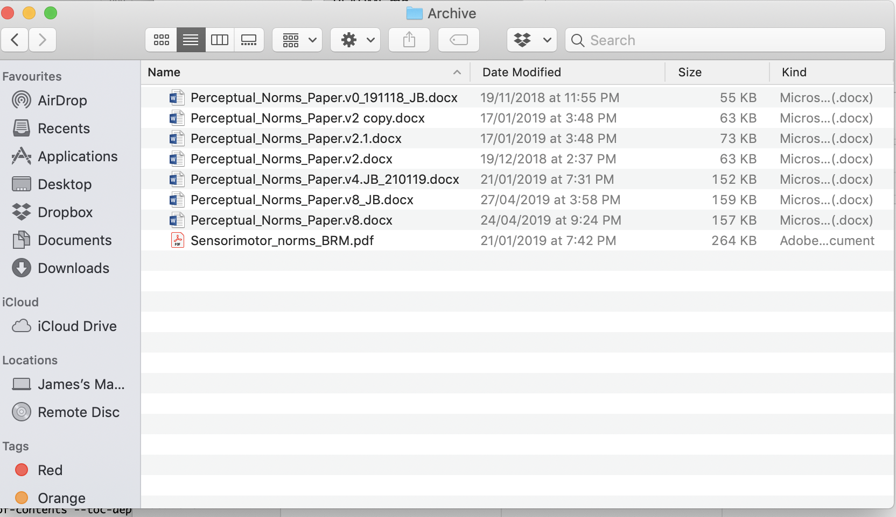
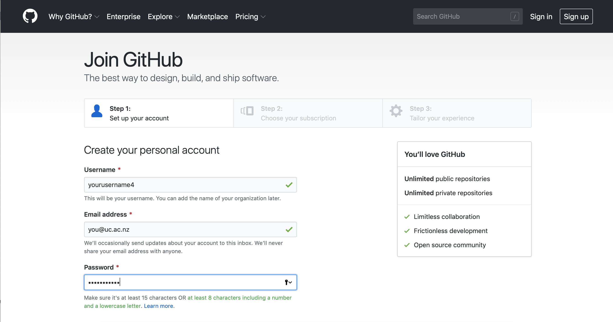
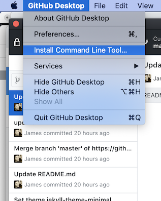

```{r setup, include=FALSE}
knitr::opts_chunk$set(echo = TRUE)
```

This worksheet aims to introduce Git and GitHub for those who have not used it before, but would like to try it out.

The main outcomes will be:

- Conceptual understanding of what Git and GitHub are
- How they can make your workflow more efficient
- Using GitHub
- Managng a repository and the changes you make
- Collaborating on projects
- Hosting your repositories on a cool website

#What is Git and GitHub

###Git {-}

Git is a thing that helps your computer keep track of files and their history. It is called a `version control system` because it knows how your files have changed over time. It will sit on your computer largely unnoticed once installed. You can think of it as being similar to `lme4` - in that it does very technical things that you will probably never need to know or think about in much detail, but being able to use it can be very helpful.

Example: You are writing a recipe for a cake in a basic `.txt` file, when you start writing the recipe it might have things like _2 eggs_, _some flour_, _a bit of milk_. You save the file and make the cake. The next time you go to this file, you might _edit_ some of the old items, so your updated file might have _2 eggs_, _100g flour_, _100ml milk_. Git can now let you compare these two versions, without the need to have 2 separate files (not so good recipe 1 and slightly better recipe 2).

###GitHub {-}

GitHub is a (free) service where you can host your Git managed projects. It is similar to Dropbox (but with some big advantages) in that you need an account, then can store your work in the 'cloud', letting you access it anywhere with an internet connection. There are other _flavours_ of this sort of service, such as `GitLab` and `BitBucket`, but we will focus on GitHub for now. It is well suited to let you collaborate with others, so the project files on your computer can be used by other collaborators, without having to send the files, let them edit it, send it back to you and so on.

Example: You put your cake recipe file on GitHub, you invite somebody to collaborate on this file (somebody who can bake a good cake), they can now access the files on their computer, make changes and _update_ your file, for instance adding _100g sugar_. When you come to use the file again, you can now access this updated version and have your old version update with the click of a button, whilst still being able to compare the two files easily.

###GitHub Desktop {-}

GitHub Desktop is a (free) app, it makes integrating your local projects (ones saved on your computer) to the cloud (ones stored online). From the app, it can make the whole process of using Git a bit more user friendly. It is similar to RStudio, which we use as an interface to R, GitHub Desktop is an interface to Git, allowing you to perform actions without having to deal with Git commands directly. It communicates the changes you make to files, allowing you to easily update and sync everything with a few clicks.

The more programmy users tend to use Git from a `shell`, see [here](https://happygitwithr.com/shell.html#shell) for more information, but I find this scary so an app is much more comfortable for me and my (relatively basic) Git requirements.

# How they can make your workflow more efficient

If you use `Dropbox` or `Google Docs` or just your `hard drive` to store and manage your research projects, you might think using Git could be a lot of hassle for little reward. But here are some reasons you might find it useful:

- How often do you back up your projects to a secure online location? If you just rely on your computer or an external hard drive, these are normally dependent on you having an up-to-date version of your files to work on, which could be a problem if they break, can not be accessed by others, are not backed up. You no longer have to deal with cluttered folders containing several versions of the one file. When you use Git you can back up files with just a click, even adding a description of what you have done since the last changes.



- Git lets you have a `master` file that you and your collaborators can work on, making edits and changes whenever, but keeping just the one file and a `version history` so you can look back efficiently on what has changed.

- Google Docs is good for online collaboration of text documents, e.g. a manuscript, but what about the R code for your analysis? Or the large data file you have? The nice thing about Git is that it functions best for code development, not just text documents. This can be particularly useful when you are working on code that is very much work in progress, hence not having the scenario where you have `analysis_version_1.5.2other.R`.

- Dropbox offers some nice ways to track different versions, and allows you to use different file formats quite easily, but Git has the added benefits of being community based. More and more researchers are using Git and GitHub to store their work, this means once you know how to use these tools, you can be a more active participant in this community. Hopefully, by the end of this tutorial you will learn how to interact with a whole world of public repostitories and see the wider appeal of GitHub over Dropbox.

- In my own opinion, the way Git makes you think about your workflow, organisation and general usability of your files is the reason I find it appetising. It can make collaboration, development and your computer all more efficient systems.

- **BUT...** it largely depends on the willingness of others to use and understand it.

#Using GitHub

---

**\*\*\*Please do these steps prior to the session if possible\*\*\***

---

For a more comprehensive tutorial on these steps, as well as Git and GitHub more generally, see:

- [GitHub's help page](https://help.github.com/en/articles/signing-up-for-a-new-github-account)

- [Jenny Bryan's tutorial](https://happygitwithr.com/github-acct.html)

- [Danielle Navarro's tutorial](https://github.com/cskemp/chdss2018/blob/master/day2_dataanalysis/git-notes.md)

- [Daniel van Strien's tutorial](https://programminghistorian.org/en/lessons/getting-started-with-github-desktop#register-for-a-github-account)

###Getting a GitHub account {-}

To use GitHub you need to have an account.

Go to [https://github.com/join](https://github.com/join) and follow the steps.

It is worthwhile to sign up using your `@uc.ac.nz` email address, this will let you access GitHub Education benefits (I think), but we can come to that another time.



<!--  -->

#GitHub's workflow and terminology

Using GitHub will be a little bit different from how you might normally manage a project. So it is worth introducing some of the basic ways GitHub is used and what certain words _mean_.

Instead of just having a file, saving it, sending it to a collaborator, receiving their version and iterating through these steps, research projects tend to have multiple files (e.g. data, R code, manuscripts, figures), each of which will likely be subject to changes over the course of the project.

###**Step 1:** Create your `repository` {-}

<mark>What is a repository?</mark>

A `repository` (or `repo`) is where all your project files belong.

If you have a folder on your computer called `PhD` and a sub-folder called `Experiment 1`, this sub-folder should be a repository and contain everything that is relevant to your experiment 1 project, e.g. more sub-folders called `data`, `analysis`, `write_up`.

Repositories are the first step in the GitHub workflow, everything inside of the repository will be tracked by Git.

Good practice is to have a `README.md` file in your repository.

<mark>What is a README.md file?</mark>

This gives anybody who is accessing your repository a reference point to go to, it should clearly explain what the repository is for, what it contains, and any other important information to help you or anybody else understand more about it.

###**Step 2:** Commiting changes

<mark>What is a `commit`?</mark>


###Terminology

There are certain new words you will encounter when using GitHub

###Installing GitHub Desktop {-}

Once you have an account, you can now download the GitHub Desktop app from:

[https://desktop.github.com](https://desktop.github.com)

Once you have installed it, it will ask you to `Sign into GitHub.com`, click this option and input your username and password.


###Installing Git {-}

To my knowledge, installing GitHub Desktop should also install Git for you.

But this may be an older version of Git, so if you get keen and want to use a shell to manage your Git projects, you might want to install a more recent version, if so you can download it at [https://git-scm.com](https://git-scm.com). As we are focussing on the basics in this tutorial, the GitHub Desktop version should be fine.

<!-- - **Easy option (Mac)**<br/> -->
<!-- In GitHub Desktop, go to GitHub Desktop in the top bar and cick `Install Command Line Tool`<br/><br/> -->
<!-- If you see a message saying `The command line tool has been installed at...` you already have Git installed. -->

<!--  -->

#Your first repository


